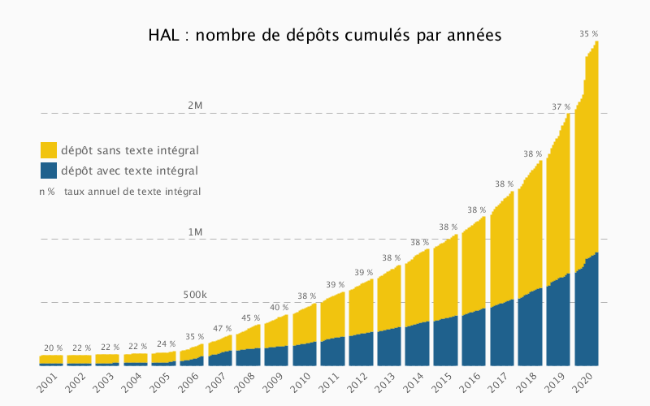
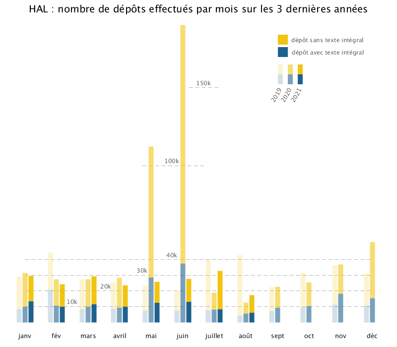

# Évolution des dépôts dans l'archive ouverte HAL

**Évenements**

2018 mars : versement des thèses de Univ. Lorraine

2018 mai : mise en place de Droit2Hal [archive univ-droit.fr/](https://web.archive.org/web/20210905201740/https://univ-droit.fr/projets/33312-droit2hal)

2019 fev. : versement des rapports HCERES 

2020 mai/juin : versement de Prodinra et Irstea

2020 nov. : compte rendu annuel d’activité des chercheurs (CRAC)

2021 juin : casuhalathon [casuhal2021.sciencesconf.org/](https://casuhal2021.sciencesconf.org/resource/page/id/8) 

  

**Quelle augmentation des dépôts en texte intégral pour le Casuhalathon 2021 ?**

~ 31 % 

Sur l'année 2021 on observe actuellement (sept. 2021) une augmentation moyenne des dépôts avec fichier de 15 % par rapport à l'année précédente.

Pour le Casuhalathon 2021 (24 mai - 11 juin) on observe, comparé à la même période l'année précédente -- après avoir retiré les versements de prodinra -- une augmentation de 46 %

  

**Quelle augmentation des dépôts en texte intégral pour le CRAC de 2020 ?**

~ 29 %

Sur l'année 2020 on observe une augmentation moyenne des dépôts avec fichier de 25 % par rapport à l'année précédente.
Pour la péiode du CRAC 2020 (nov, dec) on observe une augmentation de 54 % par rapport à la même période en 2019.

  

**Méthode**

Voir le notebook jupyter `calclul_augmentation.ipynb`

  

**Annexe**

Sur le versement de prodinra voir [archive blog CCSD 2020/03/de-prodinra-au-portail-hal-inrae](https://web.archive.org/web/20210905195211/https://www.ccsd.cnrs.fr/2020/03/de-prodinra-au-portail-hal-inrae/) et [archive  blog CCSD 2020/05/bientot-323-000-nouveaux-depots-dans-hal](https://web.archive.org/web/20210905195309/https://www.ccsd.cnrs.fr/2020/05/bientot-323-000-nouveaux-depots-dans-hal/)